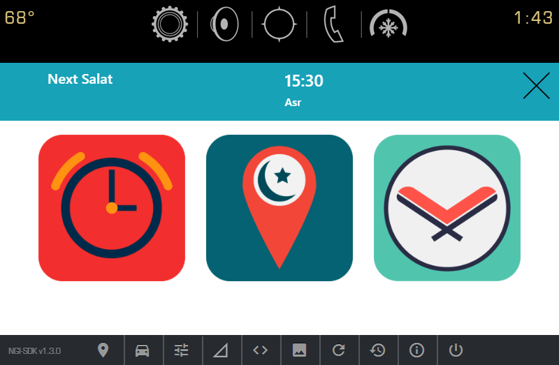
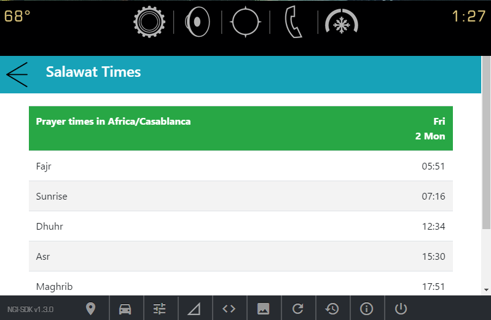
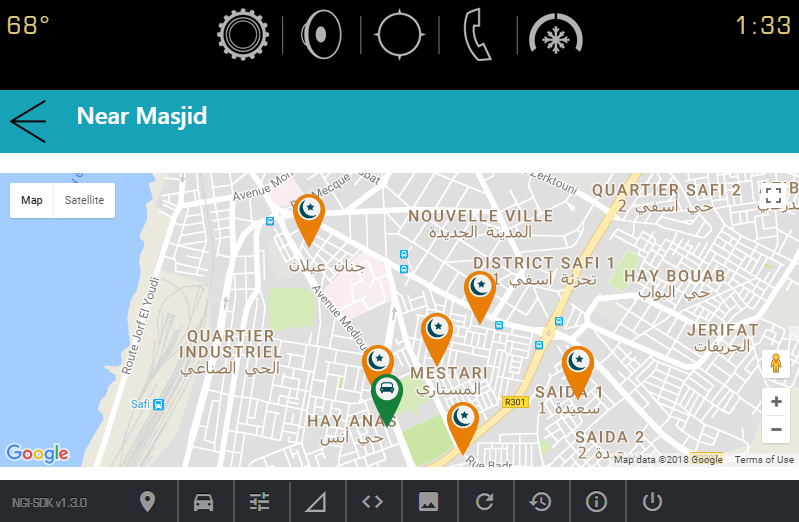
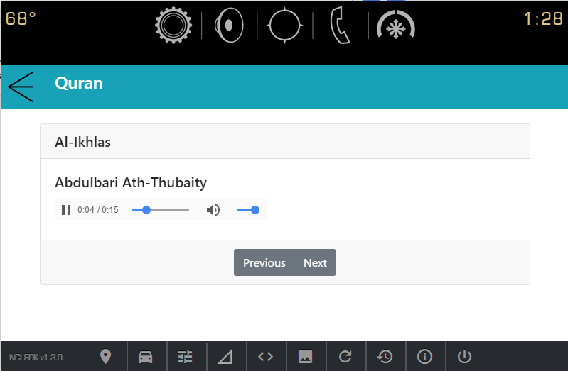

# Muslim-Driver-For-GM-Vehicles

Lets you :
	
	- Know the prayer time of the current day. 
	- Play Athan sound to remind the driver to pray.
	- Find mosque nearby within a set distance (500m).
	- Listen to Quran.

# How to Run

1. Download ngi sdk from [GM Website](https://developer.gm.com/ngi/downloads)
2. In directory, run command

```
npm install -g ./ngi-sdk.tgz
```
note: You need to be running Node 8.9.4

3. cd salat
4. run command "ngi serve"
5. Enjoy.


# About the Project

The webapp, takes gps coordinates from GM's ngi vehicle api and then uses these coordinates with :

	- The google maps api to find mosque within a set distance.
	- The [prayerTimes api](http://praytimes.org) to get prayer times.


# Screen Shots






# About us
Team : LABIBI Ayoub, KNARI Anas, CHOUAI Salim.
Master Big Data Analytics & Smart Systems.
Faculty of science Dhar Mahraz - Fez/Morocco.

